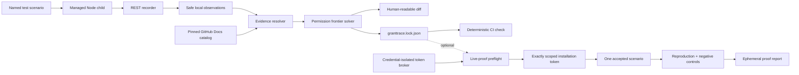

## The product problem

GitHub App permissions are easy to add and difficult to justify later. An App
may need `issues: write` for one workflow, but its settings page cannot show
which behavior depends on that grant, whether a pull request changed the need,
or whether a broad permission survives only because nobody is confident enough
to remove it.

Static source scanning is a poor fit for this problem. Routes may be assembled
through Octokit, permission requirements can contain alternatives, and the
presence of a code path does not prove a real scenario reaches it.

GrantTrace reframes the problem as a contract review:

> For these named scenarios, which GitHub REST routes were exercised, and what
> permission assignments satisfy their documented requirements?

The result is deliberately narrower than “least privilege for the entire App.”
That narrower claim can be reproduced, diffed, and defended.

## The user workflow

```text
record a named scenario
        ↓
review permission + coverage changes
        ↓
commit granttrace.lock.json
        ↓
reproduce and check it in CI
        ↓
optionally prove one scenario with a restricted live token
```

The key product decision is making acceptance human-controlled. A CI job can
detect change, but it cannot approve new access. Noninteractive execution never
updates the accepted contract.

## Architecture



The recorder keeps only a canonical method and route template, status, safe
permission requirement, evidence label, and blocking finding. Concrete URLs,
query strings, bodies, headers, credentials, repository names, resource IDs,
commands, and timestamps do not enter the contract.

Automatic capture is intentionally origin-bound. Only requests to exactly
`https://api.github.com` are observed, and only their responses can contribute
runtime permission-header evidence. Off-origin responses are ignored even when
they imitate GitHub's header. A recognized GitHub route with no runtime header
can still resolve through the pinned catalog.

## Decision 1: dynamic, scenario-bound evidence

**Choice:** observe behavior from named integration scenarios.

**Why:** the output maps to something a reviewer understands: “the triage
scenario exercised this route.” Route-to-scenario attribution also exposes
coverage removal, which a permission-only list would hide.

**Tradeoff:** unexecuted paths are invisible. GrantTrace treats that as a
published boundary, not a detail to smooth over. Teams still need meaningful
scenario coverage and cannot infer that an absent permission is safe to remove
from production.

## Decision 2: two evidence sources that must agree

**Choice:** resolve requirements from GitHub's accepted-permissions response
header and a versioned catalog reviewed against official documentation.

Runtime evidence is eligible only from `api.github.com`. When the header and
catalog both exist, their canonical permission expressions must agree. A
malformed header or disagreement blocks instead of choosing the more
convenient source. A known route may use catalog-only evidence when GitHub does
not return the header.

**Tradeoff:** the catalog covers 49 curated routes rather than pretending to
cover the entire REST API. New routes require evidence-backed maintenance, but
unknown behavior cannot silently produce a false contract.

## Decision 3: preserve permission alternatives

GitHub requirements are not always a flat list. A route may accept:

```text
issues=write OR pull_requests=write
```

Flattening that into two required permissions would overgrant. GrantTrace
models requirements in disjunctive normal form, computes every nondominated
sufficient assignment, and stores that frontier. A stable risk policy chooses
one default by preferring fewer writes, lower total access, fewer distinct
permissions, and then lexical order.

**Tradeoff:** the selected result is a documented policy choice, not a claim
that every alternative is objectively worse. Keeping the frontier makes that
judgment inspectable. Reviewers can explicitly commit another complete
candidate with `granttrace frontier select NUMBER`; later checks preserve it
while it remains valid and require review before any fallback is accepted.

## Decision 4: deterministic, identity-free artifacts

The lock is useful only if its diffs mean something. Serialization therefore
uses canonical ordering and omits machine- and run-specific values. Scenario
recordings replace their prior successful local observations atomically;
failed, interrupted, or empty runs do not erase good evidence.

**Tradeoff:** the contract cannot tell a reviewer which source line made a
call. It stores stable scenario and route identity instead, avoiding local
paths and brittle stack information.

## Decision 5: separate offline review from live proof

Normal recording and CI do not need App broker credentials. Optional `prove`
first validates the accepted contract and catalog, then asks a broker that
isolates credentials for one repository-scoped token containing only the
scenario's selected permissions, manual keeps, and GitHub's mandatory
`metadata:read`.

The proof child never receives the App private key or broker identifiers.
Applicable negative controls try the same behavior without a relevant
permission, and mutation cleanup is a separate terminal result.

**Tradeoff:** proof is intentionally operationally expensive and currently
Unix-only. It requires a dedicated disposable App and repository, and its
negative-control library is small. That is preferable to making a convenient
but unsafe production-proof promise.

## Honest provenance

A proof report includes `sourceCommit` only when Git reports a clean index and
worktree. If the source is modified, untracked, not in a Git checkout, or Git
is unavailable, the field is `null`. This avoids attributing a result from
changed code to the last commit.

The report remains ephemeral and identity-free. It establishes the inputs that
GrantTrace could safely bind, not a signed supply-chain attestation.

## Defensive engineering

Security-sensitive boundaries receive more scrutiny than ordinary CLI
plumbing:

- strict, bounded schemas reject rich or unexpected input;
- local managed files reject symlinks and unsafe ownership or modes;
- writes use private temporary siblings and atomic rename;
- child commands use argument arrays without a shell;
- interruption and timeout cannot turn partial evidence into acceptance;
- credentials never enter CLI arguments or the proof child; and
- package and tracked-file leakage scans look for sensitive residue.

The repository backs those choices with unit, integration, property,
regression, deterministic golden, concurrency, package-consumer, and
cross-platform checks.

## What this demonstrates

GrantTrace is a case study in making security tooling legible to product teams:

- start with a claim narrow enough to prove;
- preserve uncertainty instead of silently resolving it;
- turn security changes into a familiar Git review;
- distinguish retained access from tested permission-name removal; and
- keep the high-risk live workflow optional and explicitly bounded.

The first independent compatibility study now uses the source-pinned
[All Contributors Bot](/docs/external-case-study/). It identifies
which routes already resolve, which routes block a complete replay, and one
permission assumption worth reviewing. Maintainer feedback remains a separate,
explicitly unverified milestone; it is not inferred from public source code.
